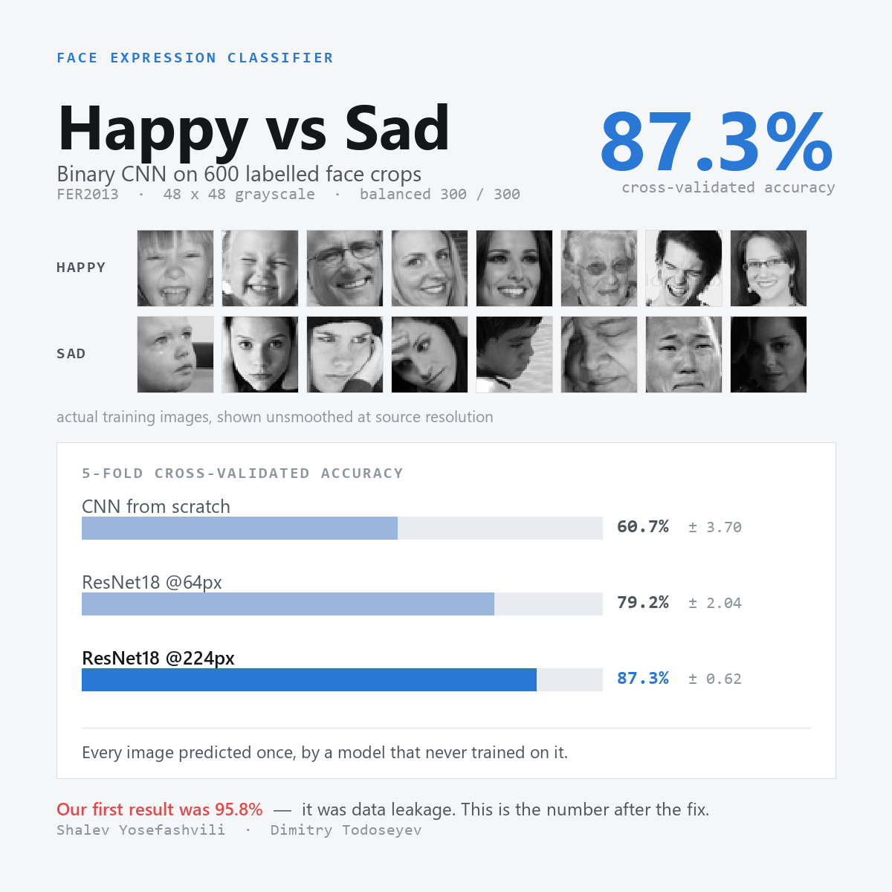

# Expression Identifier

This project is a binary image classification system designed to recognize and distinguish between "Happy" and "Sad" facial expressions.

**[Read the write-up →](docs/index.html)** — the full post-mortem, including a data-leakage bug we found in our own evaluation and what the numbers looked like once it was fixed.

> The write-up is a single self-contained HTML file. GitHub shows HTML as source rather
> than rendering it, so either clone and open `docs/index.html` in a browser, or turn on
> GitHub Pages (Settings → Pages → Source: `main` / `/docs`) to publish it at
> `https://dima252.github.io/ExpressionIdentifier-/`.



## Results

All figures are 5-fold stratified cross-validation over all 600 images: every image is
predicted exactly once, by a model that never trained on it. Mean ± standard deviation
across folds.

| Model | Accuracy | Fold spread |
|---|---|---|
| DeepCNN, trained from scratch @64px | 60.67% | ± 3.70 |
| ResNet18, fine-tuned @64px | 79.17% | ± 2.04 |
| **ResNet18, fine-tuned @224px + ImageNet normalization** | **87.33%** | **± 0.62** |

Reproduce with `python experiments/cross_validation.py`.

Two things this isolates:

- **Pretraining is worth ~18 points** over training from scratch on 600 images.
- **Feeding the pretrained backbone 224px instead of 64px is worth ~8 more**, even though
  the source images are 48×48 and upscaling adds no information. An ImageNet backbone's
  strides and receptive fields expect that scale; at 64px its deep layers see almost nothing.

The earlier notebook froze the backbone and scored 65.8%. The same approach fully
fine-tuned at the *same* resolution reaches 79.2% — freezing, not resolution, was that
experiment's mistake.

## The evaluation bug

`expressionidentifier_exercise_4.ipynb` originally built its augmented training set and
its clean validation set with two separate, unseeded `random_split` calls on two copies of
the same folder. Two shuffles produce two different permutations, so roughly **80% of the
validation set was also in the training set**.

```python
# before — two independent shuffles of the same 600 files
train_dataset_final, _ = random_split(full_dataset_aug,   [train_size, val_size])
_, val_dataset_final   = random_split(full_dataset_clean, [train_size, val_size])

# after — split the indices once, reuse them for both views
perm = torch.randperm(len(full_dataset), generator=torch.Generator().manual_seed(SEED)).tolist()
train_idx, val_idx = perm[:train_size], perm[train_size:]
train_dataset_final = Subset(dataset_aug,   train_idx)
val_dataset_final   = Subset(dataset_clean, val_idx)
assert not (set(train_idx) & set(val_idx))
```

Corrected, the two affected experiments fell by ~22 points:

| Experiment | Reported | Verified |
|---|---|---|
| 6 · CIFAR-10 pretrain → fine-tune | 94.17% | 71.67% |
| 8 · ResNet50 unfrozen | 95.83% | 74.17% |

The leak only paid out to models with the capacity to memorize. Experiment 5 used the same
leaking loaders, but dropout and augmentation held it to 70% training accuracy — and it
lost nothing when the overlap was removed.

## Project Structure

*   **`ExpressionIdentifier.ipynb`**: A Jupyter Notebook exploring expression identification. Data exploration, model training using higher-level wrappers and pre-trained models (FastAI, `resnet34` at 224px), and performance evaluation. Scores 76.67% on a correctly split validation set.
*   **`expressionidentifier_exercise_4.ipynb`**: A Jupyter Notebook demonstrating how to build and train an image classification model **from scratch using PyTorch**. It includes explicit definitions for data transformations (resizing to 64x64, normalization), dataset loading using `torchvision.datasets.ImageFolder`, a training/validation split (80%/20%), and custom DataLoader configurations. Eight experiments, re-run on the corrected split.
*   **`experiments/cross_validation.py`**: The 5-fold cross-validation harness that produces the results table above.
*   **`docs/`**: The project write-up (`index.html`) and its summary graphic.
*   **`data/`**: The directory containing the dataset images, organized by class.
    *   `data/Happy/`: Contains images of happy facial expressions.
    *   `data/Sad/`: Contains images of sad facial expressions.

## Requirements

To run the notebooks, you will need the following libraries:

*   `torch` (PyTorch)
*   `torchvision`
*   `matplotlib`
*   `numpy`
*   `jupyter`

Install them with `pip install -r requirements.txt`.

## Usage

1.  Make sure you have your dataset arranged correctly in the `data/` folder, with `Happy` and `Sad` subdirectories containing the respective images.
2.  Open the Jupyter Notebooks:
    ```bash
    jupyter notebook
    ```
3.  Run the cells in `ExpressionIdentifier.ipynb` or `expressionidentifier_exercise_4.ipynb` to train and evaluate the expression identification models.
4.  Or reproduce the headline results directly:
    ```bash
    python experiments/cross_validation.py
    ```
    Runs on CPU; the sweep takes about 12 minutes, with the 224px configuration the bulk of it.

## About the data

585 of the 600 images are 48×48 grayscale FER2013 face crops. The remaining **15 are
off-distribution** — RGB stock photos and Roboflow exports ranging from 150×100 up to
6000×4000, which are full scenes rather than face crops. They are 2.5% of the data and
have not been removed.

The main constraint on accuracy is dataset size, not architecture: every model here
saturates its training set. FER2013 ships roughly 9,000 happy and 6,000 sad images; this
subset uses 600.

## Authors
* Shalev Yosefashvili
* Dimitry Todoseyev
